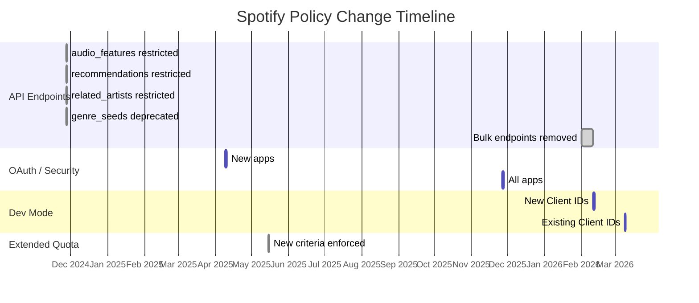

# Groovi — Spotify Compliance Audit

**Date:** February 14, 2026  
**Status:** Multiple breaking changes already in effect, more incoming March 9, 2026

---

## Timeline of Spotify Policy Changes



---

## 🔴 ALREADY BROKEN — Things That May Have Stopped Working

These changes are **already past their deadlines** as of today (Feb 14, 2026).

### 1. `recommendations` Endpoint — ❌ DEPRECATED (Nov 27, 2024)

| Detail | Value |
|--------|-------|
| **Your file** | [spotify_api.py:113-139](file:///c:/dev/work/devoops-new/song-recommender/spotify_mcp/spotify_api.py#L113-L139) |
| **Method** | `get_recommendations()` |
| **MCP Tool** | Not directly exposed, but used internally |
| **Spotify endpoint** | `GET /v1/recommendations` |
| **Status** | 🔴 Returns **404** for Development Mode apps |

```python
# This likely returns empty or errors now:
results = self.sp.recommendations(**params)
```

> [!CAUTION]
> The Spotify `/v1/recommendations` endpoint was restricted on Nov 27, 2024. Only apps with Extended Quota pre-approved before that date retain access. Your app will get **404 Not Found** errors.

**Impact:** Your AI music agent relies on MCP tools. If the agent calls `get_recommendations` through the MCP server, it will fail silently (returns `[]`).

---

### 2. `audio_features` Endpoint — ❌ DEPRECATED (Nov 27, 2024)

| Detail | Value |
|--------|-------|
| **Your file** | [spotify_api.py:141-147](file:///c:/dev/work/devoops-new/song-recommender/spotify_mcp/spotify_api.py#L141-L147) |
| **Method** | `get_track_audio_features()` |
| **MCP Tool** | `get_track_features` |
| **Spotify endpoint** | `GET /v1/audio-features/{id}` |
| **Status** | 🔴 Returns **403 Forbidden** |

> [!CAUTION]
> The `audio_features` and `audio_analysis` endpoints are now restricted. Your `get_track_features` MCP tool will return 403 errors.

---

### 3. `recommendation_genre_seeds` — ❌ DEPRECATED (Nov 27, 2024)

| Detail | Value |
|--------|-------|
| **Your file** | [spotify_api.py:149-155](file:///c:/dev/work/devoops-new/song-recommender/spotify_mcp/spotify_api.py#L149-L155) |
| **Method** | `get_available_genre_seeds()` |
| **MCP Tool** | `get_genres` |
| **Spotify endpoint** | `GET /v1/recommendations/available-genre-seeds` |
| **Status** | 🔴 Deprecated |

---

### 4. `related_artists` — ❌ DEPRECATED (Nov 27, 2024)

| Detail | Value |
|--------|-------|
| **Your file** | [spotify_api.py:197-209](file:///c:/dev/work/devoops-new/song-recommender/spotify_mcp/spotify_api.py#L197-L209) |
| **Method** | `get_related_artists()` |
| **MCP Tool** | `get_related_artists` |
| **Spotify endpoint** | `GET /v1/artists/{id}/related-artists` |
| **Status** | 🔴 Restricted for new/dev-mode apps |

---

### 5. HTTP Redirect URI — ⚠️ LIKELY BROKEN (Nov 27, 2025)

| Detail | Value |
|--------|-------|
| **Your file** | [spotify_auth.py:57](file:///c:/dev/work/devoops-new/song-recommender/backend/services/spotify_auth.py#L57) |
| **Your URI** | `http://127.0.0.1:5000/callback` |
| **Status** | ⚠️ **HTTP** — may be exempted for `127.0.0.1` but `localhost` is banned |

Spotify stated that "HTTP redirect URIs and localhost aliases will no longer be supported" as of Nov 27, 2025. However, loopback addresses like `http://127.0.0.1` **may** still be allowed (Spotify docs suggest using `http://127.0.0.1` or `http://[::1]` for local dev). Since you're using `127.0.0.1` (not `localhost`), this might still work, but:

> [!WARNING]
> Verify in your Spotify Dashboard that this redirect URI is still accepted. If it breaks, you'll need to switch to `https://127.0.0.1:5000/callback` and set up local TLS.

---

### 6. Implicit Grant Flow — ✅ YOU'RE SAFE

Your code uses `SpotifyOAuth` (Authorization Code Flow), **not** the implicit grant. This is the correct approach and is fully compliant.

---

## 🟡 BREAKING ON MARCH 9, 2026 — 23 Days Away

These changes apply to **all existing Development Mode Client IDs** on March 9, 2026.

### 7. Development Mode: Max 5 Authorized Users

| Detail | Value |
|--------|-------|
| **Deadline** | March 9, 2026 |
| **Current limit** | 25 users |
| **New limit** | **5 users** |
| **Impact** | Only 5 Spotify accounts can use your app |

If you have more than 5 users authorized in your Dashboard, extras will lose access.

### 8. Development Mode: Premium Required

| Detail | Value |
|--------|-------|
| **Deadline** | March 9, 2026 |
| **Impact** | Your developer Spotify account **must** be Premium |

> [!IMPORTANT]
> Both the Web Playback SDK **and** Development Mode will require Premium. If your old developer account is a Free account, everything stops working on March 9.

### 9. Development Mode: 1 Client ID Per Developer

| Detail | Value |
|--------|-------|
| **Deadline** | March 9, 2026 |
| **Impact** | You can only have one Development Mode Client ID |

If you have other Spotify apps under the same developer account, you'll need to choose which one to keep.

### 10. Development Mode: Restricted Endpoint Access

After March 9, 2026, Development Mode apps will only have access to a **smaller subset** of endpoints. Based on announced deprecations, these bulk endpoints are **being removed**:

| Endpoint | Your Usage | File |
|----------|-----------|------|
| `Get Several Albums` | Not used directly | — |
| `Get New Releases` | `get_new_releases()` | [spotify_api.py:250-267](file:///c:/dev/work/devoops-new/song-recommender/spotify_mcp/spotify_api.py#L250-L267) |
| `Get Several Artists` | Not used directly | — |
| `Get Artist's Albums` | Not used | — |
| `Get Artist's Top Tracks` | `get_artist_top_tracks()` | [spotify_api.py:188-195](file:///c:/dev/work/devoops-new/song-recommender/spotify_mcp/spotify_api.py#L188-L195) |
| `Get Several Tracks` | Not used directly | — |

> [!CAUTION]
> After March 9, your `get_new_releases` and `get_artist_top_tracks` MCP tools are at risk of breaking.

---

## Full Endpoint Compliance Matrix

### MCP Server Tools ([server.py](file:///c:/dev/work/devoops-new/song-recommender/spotify_mcp/server.py))

| MCP Tool | Spotify Endpoint | Status | Notes |
|----------|-----------------|--------|-------|
| `search_tracks` | `GET /v1/search` | ✅ **Safe** | Core search remains available |
| `search_artist` | `GET /v1/search` | ✅ **Safe** | Uses search endpoint |
| `get_artist_top_tracks` | `GET /v1/artists/{id}/top-tracks` | 🟡 **At Risk** | Listed for removal in Feb 2026 bulk endpoints |
| `get_related_artists` | `GET /v1/artists/{id}/related-artists` | 🔴 **Broken** | Restricted since Nov 2024 |
| `search_playlists` | `GET /v1/search` | ✅ **Safe** | Uses search endpoint |
| `get_playlist_tracks` | `GET /v1/playlists/{id}/tracks` | ✅ **Safe** | Still available |
| `search_by_genre` | `GET /v1/search` (with `genre:` filter) | ⚠️ **Uncertain** | Genre filter in search may have reduced accuracy |
| `get_genres` | `GET /v1/recommendations/available-genre-seeds` | 🔴 **Broken** | Deprecated |
| `get_new_releases` | `GET /v1/browse/new-releases` | 🟡 **At Risk** | Listed for removal in Feb 2026 |
| `create_playlist` | `POST /v1/users/{id}/playlists` + `POST /v1/playlists/{id}/tracks` | ✅ **Safe** | User-scoped, requires auth |
| `get_track_features` | `GET /v1/audio-features/{id}` | 🔴 **Broken** | Restricted since Nov 2024 |

### Backend Auth Endpoints ([main.py](file:///c:/dev/work/devoops-new/song-recommender/backend/main.py))

| Endpoint | Purpose | Status | Notes |
|----------|---------|--------|-------|
| `/auth/login` | Get OAuth URL | ✅ **Safe** | Auth Code Flow is correct |
| `/auth/login/redirect` | Redirect to Spotify | ✅ **Safe** | — |
| `/callback` | OAuth callback | ⚠️ **HTTP URI risk** | See item 5 above |
| `/auth/token` | Get access token | ✅ **Safe** | Token refresh works |
| `/auth/status` | Check auth | ✅ **Safe** | — |
| `/playlist/create` | Create playlist via MCP | ✅ **Safe** | — |

### Frontend SDK ([SpotifyPlayer.tsx](file:///c:/dev/work/devoops-new/song-recommender/frontend/src/components/SpotifyPlayer.tsx))

| Feature | Spotify API | Status | Notes |
|---------|------------|--------|-------|
| Web Playback SDK init | `sdk.scdn.co/spotify-player.js` | ✅ **Safe** | SDK itself is still supported |
| Player connect | `player.connect()` | ✅ **Safe** | Core SDK method |
| Start playback | `PUT /v1/me/player/play` | ✅ **Safe** | User playback control |
| Device listing | `GET /v1/me/player/devices` | ✅ **Safe** | User-scoped |
| Toggle shuffle | `PUT /v1/me/player/shuffle` | ✅ **Safe** | User playback control |
| Set repeat | `PUT /v1/me/player/repeat` | ✅ **Safe** | User playback control |
| Like/Unlike songs | `PUT/DELETE /v1/me/tracks` | ✅ **Safe** | User library |
| Check liked | `GET /v1/me/tracks/contains` | ✅ **Safe** | User library |
| Transfer playback | `PUT /v1/me/player` | ✅ **Safe** | User playback control |

### OAuth Scopes ([spotify_auth.py](file:///c:/dev/work/devoops-new/song-recommender/backend/services/spotify_auth.py#L24-L35))

| Scope | Status | Notes |
|-------|--------|-------|
| `streaming` | ✅ **Safe** | Required for Web Playback SDK |
| `user-read-email` | ✅ **Safe** | Required for Web Playback SDK |
| `user-read-private` | ✅ **Safe** | Required for Web Playback SDK |
| `user-modify-playback-state` | ✅ **Safe** | Playback control |
| `user-read-playback-state` | ✅ **Safe** | Playback state |
| `user-read-currently-playing` | ✅ **Safe** | Current track |
| `playlist-modify-public` | ✅ **Safe** | Playlist creation |
| `playlist-modify-private` | ✅ **Safe** | Playlist creation |
| `user-library-read` | ✅ **Safe** | Like status |
| `user-library-modify` | ✅ **Safe** | Like/unlike |

---

## Summary Scorecard

| Category | Score | Details |
|----------|-------|---------|
| **OAuth Flow** | ✅ 9/10 | Auth Code Flow is correct. Only risk: HTTP redirect URI |
| **OAuth Scopes** | ✅ 10/10 | All scopes are valid and supported |
| **Web Playback SDK** | ✅ 10/10 | SDK usage is correct and fully compliant |
| **Frontend API Calls** | ✅ 10/10 | All user-scoped playback/library endpoints are safe |
| **MCP Search Tools** | ✅ 8/10 | `search_tracks`, `search_playlists` are safe |
| **MCP Discovery Tools** | 🔴 2/10 | 4 out of 6 discovery tools are broken or at risk |
| **Development Mode** | 🟡 5/10 | Premium + 5 users + 1 Client ID after March 9 |

---

## Action Items

### 🔴 Immediate (Already broken)
1. **[RESOLVED]** `get_track_features` MCP tool — `audio_features` endpoint stubbed (returns None)
2. **[RESOLVED]** `get_genres` MCP tool — `recommendation_genre_seeds` endpoint stubbed (returns [])
3. **[RESOLVED]** `get_related_artists` MCP tool — endpoint stubbed (returns [])
4. **[RESOLVED]** `get_recommendations()` method — endpoint stubbed (returns [])
5. **Verify** the `http://127.0.0.1:5000/callback` redirect URI still works in your Dashboard

### 🟡 Before March 9, 2026 (23 days)
6. **Ensure** your developer Spotify account has **Premium**
7. **Reduce** authorized users to 5 or fewer in Dashboard
8. **Keep only 1** Development Mode Client ID
9. **[RESOLVED]** `get_artist_top_tracks` and `get_new_releases` — endpoints stubbed (return [])
10. **[RESOLVED]** AI agent tools updated — removed broken tools, updated prompts to use `search_tracks` only

### ✅ Safe — No Action Needed
- Web Playback SDK initialization and playback controls
- OAuth Authorization Code Flow (not implicit grant)
- All user-scoped endpoints (playback, library, playlists)
- OAuth scopes
- Embed player fallback
